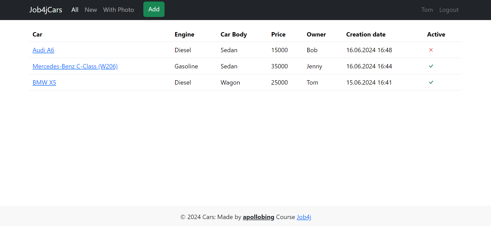
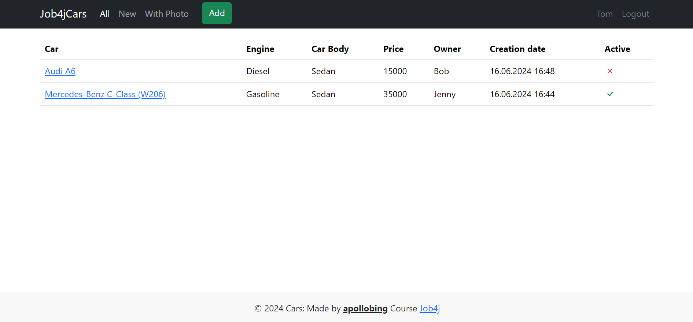
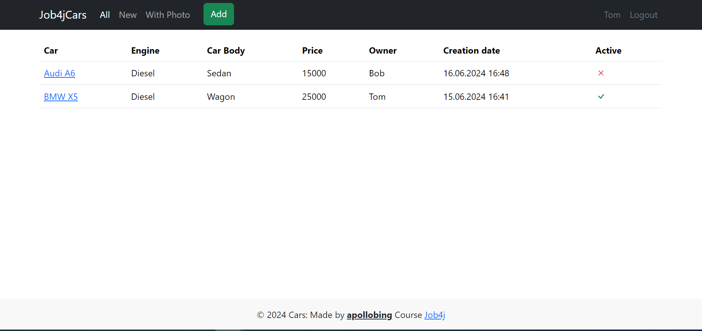
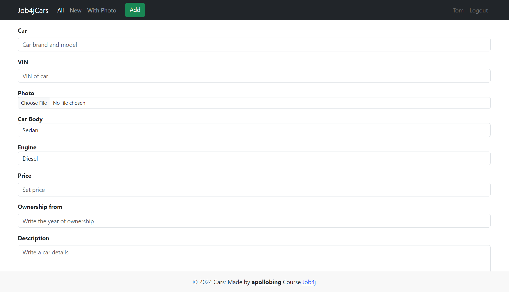
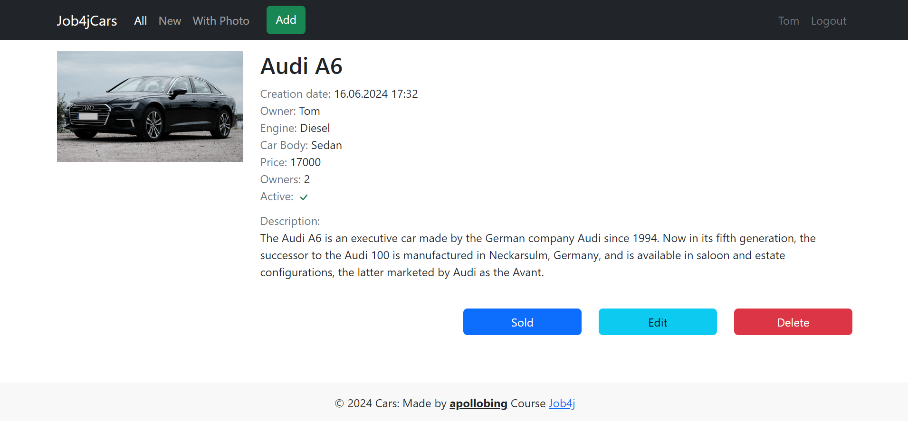
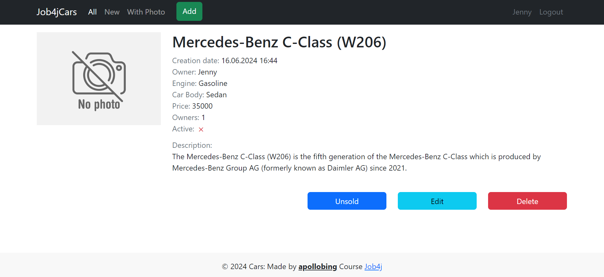
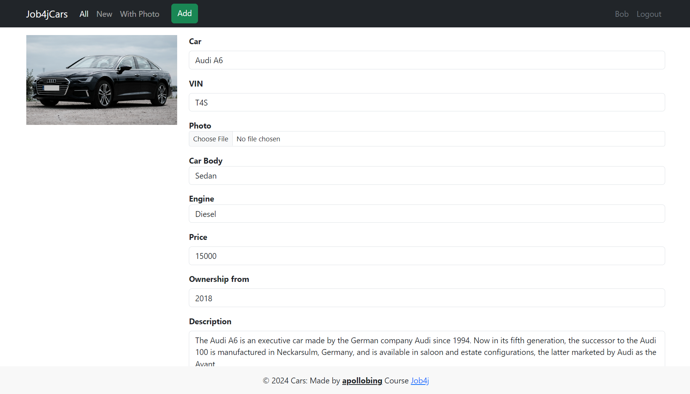
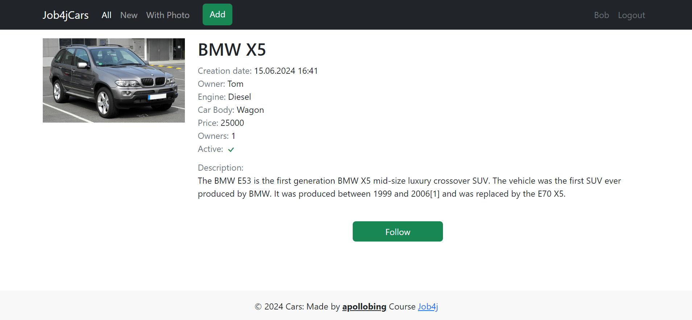
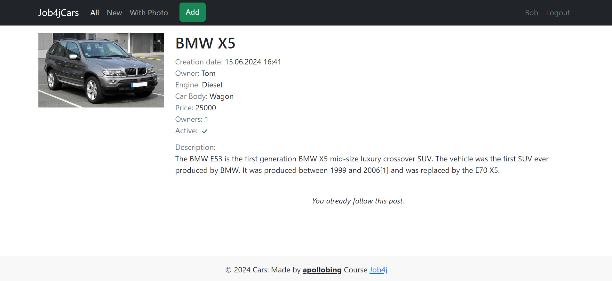
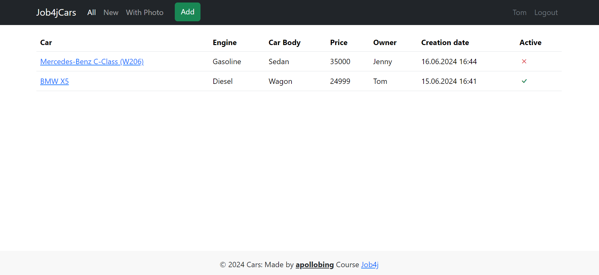

# job4j_cars

## About project

Job4jCars project is a service where you can sell cars.
It allows you to register a new user or login if you already register.
Service contains advertisements for car sales, and it allows you to publish new advertisements.
An advertisement contains brand, model, body type, description and photo of selling car.
Data about new users and advertisements saves in DB.

Technologies used in the project:
* Spring boot 3.2.4
* Tomcat 10.1.19
* Thymeleaf 3.1.2
* Bootstrap 5.3.3
* Lombok 1.18.32
* Liquibase 4.15.0
* PostgreSQL 42.7.3
* h2database 2.2.224
* Hibernate 6.4.4
* jcip-annotations 1.0
* checkstyle-plugin 3.3.1
* puppycrawl 10.15.0

Necessary environment:
* Java 17
* Maven 3.9.4
* PostgreSQL 14

To run the application you need:

1. Create a database named `cars` in PostgreSQL
```
    create database cars;
```

2. In Profiles section on Maven tab choose `production` profile


3. Build the project and run the Spring Boot application
```
    mvn clean install -Pproduction
    mvn spring-boot:run
```
`Or instead of mvn spring-boot:run command, please run main() method in Main class`

4. Open http://localhost:8080/ in your browser


5. Optional: if needed test environment, you can choose `test` profile in Profiles section on Maven tab
   and execute commands:
    * `mvn clean install -Ptest`
    * `mvn spring-boot:run`
        * `Or instead of mvn spring-boot:run command, please run main() method in Main class`
### Screenshots

#### Page with advertisements of all cars:


#### Page with new advertisements of cars:


#### Page with advertisements that contains photo of cars:


#### Add advertisement page:


#### Advertisement page where the car is not marked as sold:


#### Advertisement page where the car is marked as sold:


#### Edit advertisement page:


#### Advertisement page of the car before following:


#### Advertisement page of the car after following:


#### Page with advertisements of all cars (after deleting and editing advertisements):


If you have any questions about this project, please let me know.